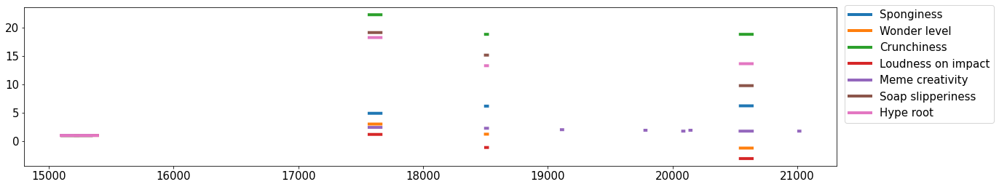
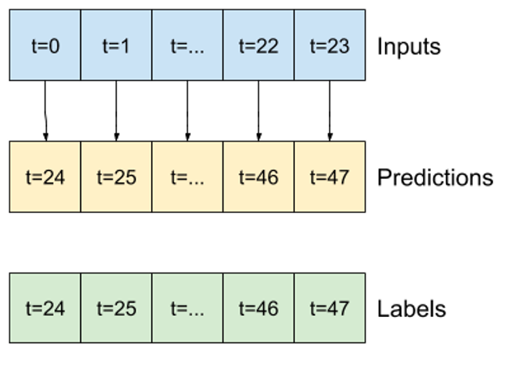
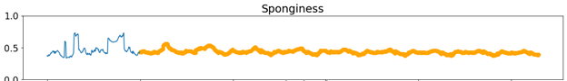
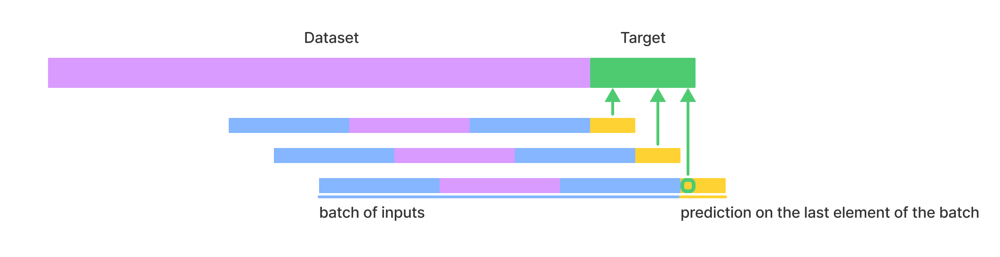
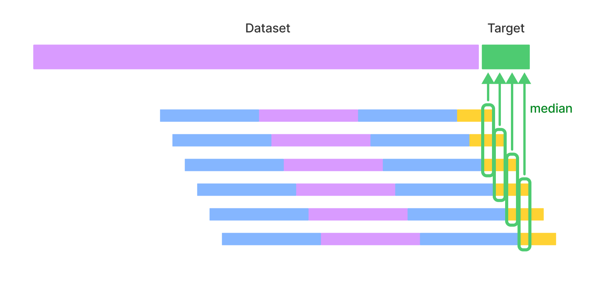
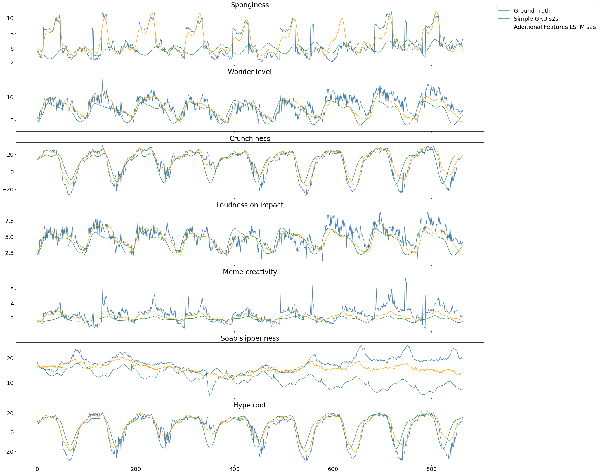

# Multivariate-Time-Series-Forecasting
> through deep learning models with different structures based on LSTM, GRU, and Transformers

## 1. Introduction
The problem we had to face is time series forecasting for multinomial data. To address this task, we used deep learning models with different structures based on LSTM and GRU, and Transformers. 

Our dataset is composed of 68.528 samples of 7 different time series and the aim of the study is to forecast the next 864 points for each feature. 
From a preliminary analysis of the signals [\texttt{Notebook 1}], it came out that they have an almost constant mean and show a periodicity of 96 for all the 7 features. The 7 components have values on very different scales with respect to each other (e.g. Meme creativity $\in [-1.28, 6.06]$ with mean 2.41 and Soap slipperiness $\in [-6.00, 77.37]$ with mean 23.24), hence we needed to apply a normalization (or standardization) before starting to work with the analyses. 
We can detect a certain correlation between the variables \textit{Crunchiness} and \textit{Hype root}, as well as between \textit{Loudness on Impact} and \textit{Wonder Level}. Sometimes, we also have unusual behaviour: most of the values of Crunchiness and Hype Root are positive, but have some negative peaks.

Finally, we have noticed that the data is partially corrupted: there are in fact relatively long sequences of constant data, as shown in Figure 1. This will be an issue that we should address.

    
    

    Figure 1: An example of constant intervals in the range $[15000, 25000]$.
    
   
## 2. Cleaning function
Training a neural network with corrupted data as shown above may condition the network, which would consider such behaviour as an intended one. We thought that, to deal with such intervals, we had to remove them; this was done at the level of window generation, discarding all the windows whose target interval had more than a fixed fraction of the signal corrupted. We considered an interval corrupted only when it has a substantial number of contiguous constant values [`Notebook 2`].

## 3. Baseline
To evaluate subsequent models, we need a yardstick. We choose to take as a baseline a very simple model that provides as prediction a copy of the last $n$ values (as shown in Figure 2. 
In truth, this very simple approach works relatively well since the signal is periodic and very regular (score of 6.00).

    
    

    Figure 2: In the baseline, predictions are equal to the last n (24 in the figure) values.

## 4. A first simple Sequence-to-Sequence Model
The first model we considered is a simple sequence to sequence model based on the classical encoder-decoder structure (made on LSTM layers). We added a batch normalization layer to reduce vanishing gradient problem. Initially, we considered 64 as number of LSTM units, and we tried to improve the performance by changing the size of input window/telescope. We soon realized that a much higher number of units per layers was needed to achieve performance comparable to the baseline one (at least 200). 

However, the training of these networks is particularly long, so we have tried replacing LSTMs with GRUs. Finally, we have implemented seq-to-seq architectures with attention based on LSTM. Both approaches resulted in about 10% improvement. We noticed that increasing the number of layers and using some activation functions (as for example **relu**, the loss function may explode. The best model was based on GRU layers (with 200 units and a \texttt{elu} activation function), performing a good results (score 4.35) with respect to the baseline score [`Notebook 3`].

## 5. Convolutional-Bidirectional LSTM Model
Then, we started implementing models with bidirectional LSTM layers (128 and 256 units) alternated with one dimensional convolutional layer (256 units). They worked pretty well but still lost some information as you can see in the Figure 3 where autoregression is used: the full amplitude of the signal is not reached by the prediction. Training our model with different values of telescope and window size in input, we obtained very different performances. In particular, too small telescopes tend to give poor results: the model is not able to "follow the periodicity of the signal" in the predictions. In particular, we have noticed that even if we significantly increase the window size, the model still performs poorly if the telescope is less than one season (96 temporal units)
    

    
    

    Figure 3: The prediction points never reach the full amplitude of the Sponginess signal.
        
Among those we trained, the model that performed best had a window size of 576 and a telescope of 192 (score 5.29). This model covers the whole amplitude of the signal quite well.

To additionally improve the performance of our models, we used $\texttt{keras-tuner}$, a hyperparameter tuning tool. The method we decided to use was `Hyperband`, as performing a grid or random search would have been too costly. Continuing to use a structure based on bidirectional LSTM layers and convolutional layers, we have implemented a tuning on the number of layers, the number of units per layer and the dropout rate. We tuned some of the models that performed best in the previous step, but none of them showed noteworthy improvements. 

## 6. Adding helpful features
To help our models keep track of the periodicity of the signals, we decided to add two signals as input: a sin and a cosine with a frequency of 96 and we also decided to increase the number of LSTM units in our recurring layers. The model we trained with these inputs consists of two bidirectional LSTM layers, each composed by 288 units, followed by a dense layer and in the end three convolutional layers. The input window is 288 samples wide while the telescope is 96. The model [`Notebook 4`] was able to easily keep track of the periodicity of the signal, making it achieve the best results we obtained during this assignment with a score of 4.00.
        
## 7. Transformer
After extensive testing with LSTMs, we decided to try using transformers, which would allow us to significantly speed up our training parallelizing the task. The model was composed of 2 transformer blocks, a dense layer and finally a convolutional layer. The transformer block contained a Multi Head Attention layer with 2 heads of size 64 and 2 layers of 1D convolution. With a window size of 480 and a telescope of 24 the model obtained an mse value of 0.058 on the 24-size test set, but by prolonging the prediction on a greater interval through autoregression, it can be seen that the model is able to learn the periodicity of the signals but not well its amplitude [`Notebook 5`].

## 8. Overlapping autoregression
To better exploit the characteristics of memory based networks, and more specifically make the state of the network at prediction time more meaningful, we implemented two different functions to make better predictions [`Notebook 6`].

The first autoreg$\_$prediction makes a prediction using only the outputs of the last elements of a batch. Hence, the first batch considered is the one ending on the last sample of the dataset. The prediction on the last element of the same is appended to the dataset and a new batch, ending on the new last sample of the dataset is drawn (Figure 4). This process is repeated until the prediction reaches the target length.

    
    

    Figure 4: Autoreg_prediction makes a prediction using only last window-size outputs.

The second overlapping$\_$autoreg$\_$prediction uses batches in the same manner as the previous one but, instead of trusting the prediction made immediately, multiple predictions on the same elements are made by shifting the end of the batch considered by 1. This results in having, for each value we want to predict, as many predictions as the number of outputs of the considered model. The value to append to the dataset is chosen as the median of all the predictions, making it more robust with respect to outliers. The process is shown in Figure 5. Unfortunately, although this method gave slightly better predictions, we were not able to use it in the assignment as it took to much time and caused a timeout to be issued from the server.

    
    

    Figure 5: overlapping_autoreg_prediction considers as prediction the median of multiple predictions.
    
## 9. Conclusion
In our work, we tried several variations of LSTM-based or GRU-based seq-to-seq, we added some convolutional layers, we changed approach using Transformer, finally we implemented different autoregression predictors.

The hyperparameters we found to be the most impactful were: the window size, the telescope and the number of units in our recurring layers. The best results were achieved increasing these factors, however, the training time of these models with many units proved to be particularly long.

The models which best performed were the bidirectional LSTM with additional feature having a score of 4.00 and the one with GRU layers giving a score of 4.35. The different predictions are visible in the Figure 6.
Further experimentation tuning the hyperparameters of our models could still improve the performance of seq-to-seq models with memory and we may get better results by rebuilding the corrupted intervals of our signals. 

    
    

    Figure 6: Comparison of the various predictions on the test set based on different models.

## Acknowledgement
This project was realised together with `Giovanni Dragonetti` and `Erica Espinosa`. It was one of the challanges of the [`Artificial Neural Networks and Deep Learning`](http://chrome.ws.dei.polimi.it/index.php?title=Artificial_Neural_Networks_and_Deep_Learning) course held in the winter of 2021 at `Politecnico di Milano`.
